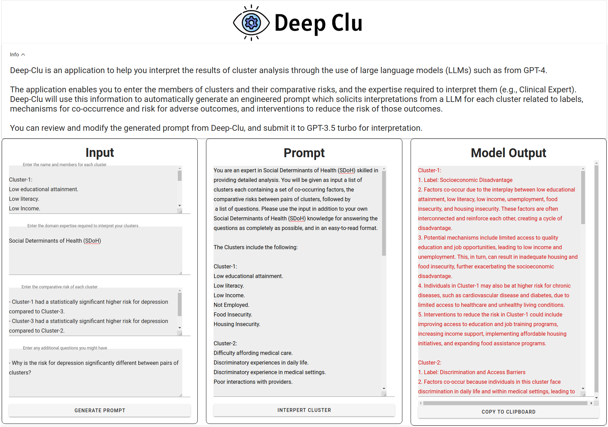

<div align="center">
  
</div>

# Deep Clu: Deep Learning Cluster Interpretation

This repository contains the code for the Deep Clu tool, designed for cluster interpretation. The development and functionality of this tool is explained in greater detail in our [accompanying paper](URL).

The transformative capabilities of Large Language Models (LLMs) have been widely acknowledged in the clinical domain, with applications ranging from clinical decision support tools to documentation generators. However, the potential use of LLMs in data analysis has not been as extensively explored. Deep Clu is a proof of concept demonstrating the utility of LLMs in analyzing the output of machine learning algorithms.

## Tool Methodology
Deep Clu utilizes the impressive capabilities of GPT-3.5 Turbo, a state-of-the-art LLM, to analyze your machine learning output. This tool will guide you through the process of creating a prompt, customizing it as per your requirements, and submitting it to GPT-3.5 to receive an interpretation of your results.

## How to Use

Deep Clu is composed of three main parts: 



### Cluster Input
In the 'Cluster Input' section, you will be prompted to provide the output of your clustering algorithm, your preferred expert, pairwise risk coefficients, and any specific questions you wish to have answered about the data. For reference, the form will always query the model with the following questions about your output:

```   
    1. What label would best describe the co-occurring factors in each cluster?
    2. Why do the factors in each cluster co-occur?
    3. What are the potential mechanisms in each cluster?
    4. What other potential risks for adverse outcomes can be predicted for individuals in each cluster?
    5. What interventions could reduce the risk in each cluster?
```

Please list your questions in a bulleted format to ensure the highest output quality.

### Prompt

After clicking 'Generate Prompt', you will see the generated prompt. This gives you a chance to tweak the prompt as needed before sending it to the model. Once the prompt is satisfactory, click 'Submit' to send it for analysis.

### Output

This section displays the response from the GPT-3.5 model to your prompt. The output can be copied to your device's clipboard for further usage.

# How to Run

You can use the files in this repository to host a local version of the Deep Clu instance. Note that we are currently working on a hosted version for broader accessibility.

### Server

To install the local environment, you will need to install the dependencies listed in the `requirements.txt` file. Run the following command in your terminal:

```pip install -r requirements.txt```

Then, start the server by running app.py

```python3 app.py```

### Client
Firstly, ensure that `npm`, `vue`, and `vueify` are installed on your machine. If not, you can install them using the following commands:

```
npm install -g npm
npm install -g vue
npm install -g vueify
```
Next, navigate to the client directory and install the necessary dependencies:

```
cd client
npm install
```
To run the client, use the command:
npm run dev


## License

This software is licensed under the MIT License. For more information, please refer to the [LICENSE] file in this repository.
